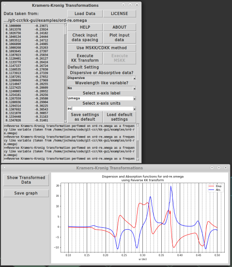

# KK-GUI: Software with graphical interface to perform Kramers-Kronig transformations

This software is useful if you have absorptive or dispersive spectral
data and want to perform a Kramers-Kronig (KK) transformation to
obtain the dispersive / absorptive counterpart. A screen shot is shown below.

Works under Linux and Windows (perhaps Mac, too) and comes in two
versions that are both included in the package. Both versions are
written in Python and use the Python interface with Tcl/Tk and
Matplotlib for the GUI and the resulting plots. One version includes
numerical routines in Fortran that need to be compiled. The second
version is Python-only and does not require a
compiler, but its KK transformations run slower.

It is possible to
perform 'anchored' KK transformations known as multiply subtractive KK
(MSKK) or chained doubly-subtractive KK (CDKK); these methods are
described in Reference [1] and literature cited therein.

KK-GUI was developed in 2017 by Herbert Ludowieg, an undergraduate
research assistant in my group, based on prior developments by Mark
Rudolph, Patrick Dawson, and Dr. Mikhail Krykunov.

Relevant references are:

[1] Rudolph, M.; Autschbach, J., Fast generation of nonresonant and resonant Optical Rotatory Dispersion curves with the help of Circular Dichroism calculations and Kramers-Kronig transformations, Chirality 2008, 20, 995–1008.
URL https://doi.org/10.1002/chir.20547

[2] Krykunov, M.; Kundrat, M. D.; Autschbach, J., Calculation of circular dichroism spectra from optical rotatory dispersion, and vice versa, as complementary tools for theoretical studies of optical activity using time–dependent density functional theory, J. Chem. Phys. 2006, 125, 194110. 
URL https://doi.org/10.1063/1.23633

